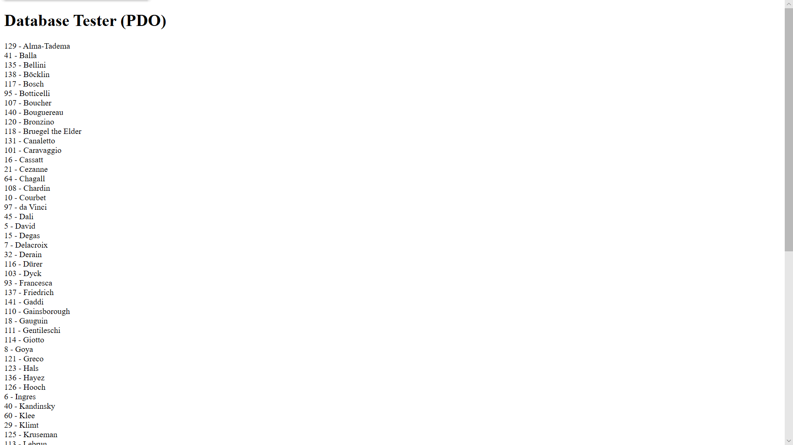

# Lab10设计文档

### Exercise7

##### PDO
使用数据对象PDO访问数据库，通过query完成搜索。

##### mysqli
使用一系列mysqli函数访问数据库，通过mysqli_query完成搜索。

### Exercise8

##### outputArtists()
按照LastName从数据库中取前三十条数据，按照规则输出并吧ArtistID记录在html元素的id中。

##### outputPaintings()
获取html元素的id值并查找到该ArtistID对应的Paintings，然后调用outputSinglePainting()来输出。

##### outputSinglePainting()
输出单张Painting的html元素的代码。

### Exercise9

##### 执行sql语句的方式

1. exec()方法:
返回执行SQL语句后受影响的行数，通常用于INSERT，DELETE和UPDATE语句中。（SELECT时总是返回0）

2. query()方法
返回执行查询后的结果集（PDO对象）。

3. 预处理语句：prepare()语句和execute()语句
通过prepare()方法做查询准备工作、execute()方法执行查询。
优势：解析查询只有一次，性能稍优。

### Exercise10

按照GenreID顺序查找数据，调用outputGenres()和outputSingleGenre()方法来输出。

