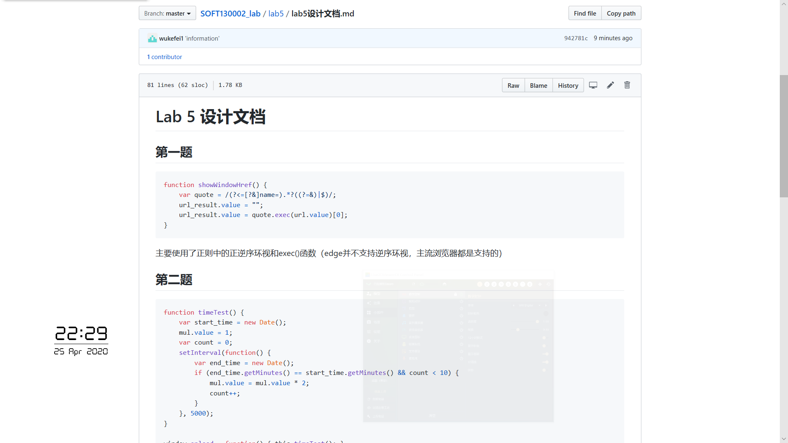
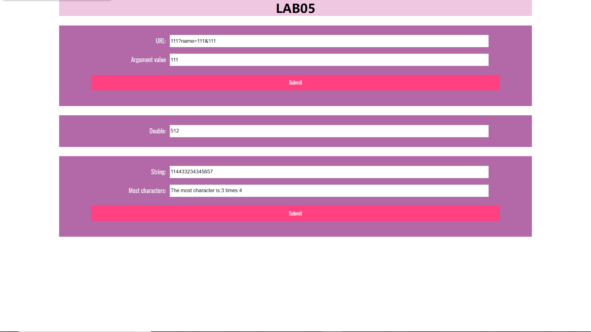

# Lab 5 设计文档

## 第一题

```javascript
function showWindowHref() {
    var quote = /(?<=[?&]name=).*?((?=&)|$)/;
    url_result.value = "";
    url_result.value = quote.exec(url.value)[0];
}
```

主要使用了正则中的正逆序环视和exec()函数（edge并不支持逆序环视，主流浏览器都是支持的）

## 第二题

```javascript
function timeTest() {
    var start_time = new Date();
    mul.value = 1;
    var count = 0;
    setInterval(function() {
        var end_time = new Date();
        if (end_time.getMinutes() == start_time.getMinutes() && count < 10) {
            mul.value = mul.value * 2;
            count++;
        }
    }, 5000);
}

window.onload = function() { this.timeTest(); }
```

主要使用了setInterval()函数，并通过getMinutes()判断是否分钟改变，在界面加载完毕时运行函数

## 第三题

```javascript
let most = document.getElementById("most");
let result = document.getElementById("most-result");
let most_submit = document.getElementById("most_submit");
most_submit.addEventListener('click', arrSameStr);

function arrSameStr() {
    let index;
    let max = -1;
    let str = most.value;

    let obj = {};
    let letter;
    for (var i = 0, len = str.length; i < len; i++) {
        letter = str[i];
        if (!obj[letter]) {
            obj[letter] = 1;
        } else {
            obj[letter]++;
        }
    }
    for (key in obj) {
        if (max < obj[key]) {
            max = obj[key];
            index = key;
        }
    }

    result.value = "The most character is:" + index + " times:" + max;
}
```

主要使用了关联数组来存储字符和对应出现个数，遍历数组确定最多出现字符和对应次数

## 截图

github截图：


链接：[https://github.com/wukefei1/SOFT130002_lab/blob/master/lab5/lab5设计文档.md](https://github.com/wukefei1/SOFT130002_lab/blob/master/lab5/lab5设计文档.md)

网页效果截图：



