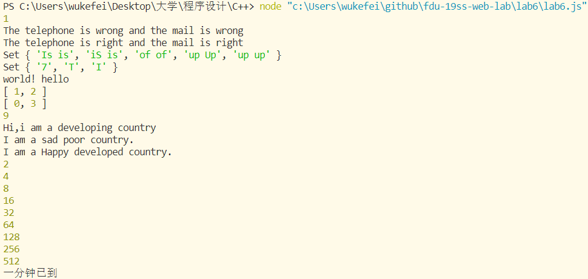

# Lab6设计文档

## 正则表达式解释

### 第二题：

```javascript
    var str_tele = /^1[34578]\d{9}$/;
    var str_mail = /^[a-zA-Z0-9_-]+@[a-zA-Z0-9_-]+(\.[a-zA-Z0-9_-]+)+$/;
```

电话号码构成为1开头加上1位数字（移动、联通、电信）和九位任意数字构成。

邮箱中用户名支持大小写字母、中划线、下划线，域名支持多级域名（贪婪模式匹配）。

### 第三题：

```javascript
    var str_redundancy = /(\b\w+\b)(?:\s\1)+\b/gi;
```

"\b\w+\b"匹配单词，采用贪婪模式并用\s\1匹配中间带有空格的多个的相同单词，结尾加上'i'来实现忽略大小写，如“is Is IS isnt"匹配出“is Is IS"，后续再用split函数拆为两项的组合。

## 继承不同方式的理解

构造函数：在子类的构造函数开头用call调用父类的构造函数，能够继承父类的属性，但是无法复用父类的实例方法，也无法访问到父类原型中的属性和方法。

原型链：把子类的原型设置为父类的一个实例，可以覆盖父类的方法，缺点是会把父类的实例属性当作子类原型的属性，在向父类构造函数传参时子类会受影响。

Object.create()：将一个对象作为另一个对象的基础，创建了一个父类的原型的对象，再加上子类自己的属性作为子类的原型。

## Map、Set、Array之间的区别和使用

获取大小Map和Set使用size，Array使用length；

Map中存放键值对(Key:Value)；

Map中可以对一个键多次赋值，值为最终赋的值；Array可以多次添加相同元素；Set中添加重复元素不会发生改变。

## 截图

### Github仓库截图：


### VScode中测试代码和运行结果界面：
```javascript
function test() {
    testTime();
    testMail("", "");
    testMail("13817703531", "19302010012@fudan.com.cn");
    testRedundancy("Is is the iS is cost of of gasoline going up up Up");
    testKeyBoard("7_This_is_a_test", "_hs_s_a_es");
    testSpecialReverse("  hello  world!  ");
    twoSum([1, 2, 3, 4], 5);
    lengthOfLongestSubstring("abcdabsdefghsfgmwrlegn");
    new DevelopingCountry().sayHi();
    new PoorCountry().saySad();
    new DevelopedCountry().sayHappy();
}
test();
```
### 